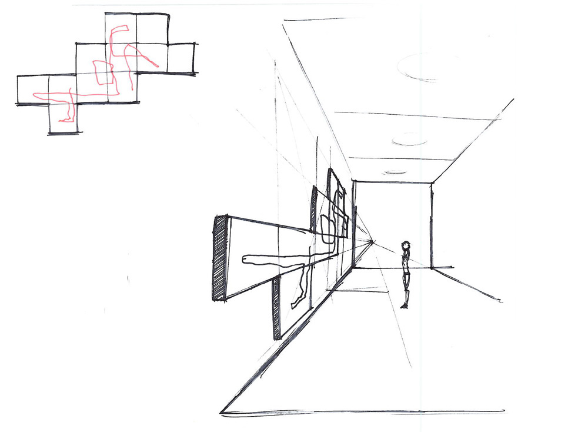
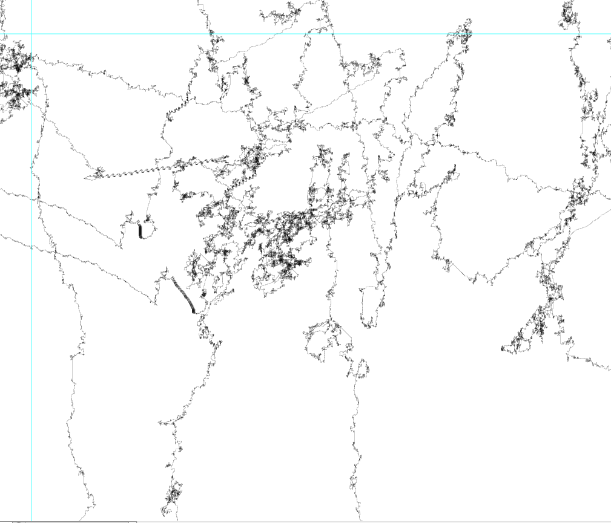

###Prologue
this is my project log until I decided to participate to dev art.

####2010

Back in 2010 I had the following idea:
The information stored in the human dna is represented by a nearly endless sequence of only four different letters: T, C, G and A. What if I interpret those four letters as drawing directions: T means one step up, C one step to the right, and so on. How will it look like? Are there emerging patterns? Could that idea even have scientific relevance?
Back then early experiments showed interesting results, however due to work related obligations this idea moved out of my focus.

####February 2014
Heard about the devart project, old idea popped up, visualisation could be made available to the public as a separate layer with google maps.

####Feb 21 14
started with research about Genetics, mainly wikipedia: genome, dna, chromosome, nucleic bases
came across amino acids: amino acids seem to be defined as a three nucleic bases, there are around 20 amino acids symbolized by letters:


**Finding** applying my drawing rules did not lead to specific patters as the line combinations cannot clearly mapped back to the amino acid symbols. -> I'll  stick with drawing rules.

####Feb 23 14, tcg_i1_1

**Data** downloaded chromosome 1 of human from [http://hgdownload.soe.ucsc.edu/downloads.html](http://hgdownload.soe.ucsc.edu/downloads.html)

**Code** first sketch, render chromosome1


**Findings** 
+ some repetitions are visible. 
+ overall direction toward upper left corner. Means the sequence consists mostly of Ts and As.
+ did tests with different mappings of tcga to up-right-down-left. visual output differs if opposing chars are altered otherwise the picture is flipped or rotated.
-> while t-c-g-a  for up, right, down, left gives the most appealing result,  I stay with this config for now.
+ done some **research:** tcga is often referred to as base pairs , where *t matches with a, c with g*, so they are some kind of counter parts, therefore I seems logic to take t & a and c & g in opposite directions 

**data structure** 

+ the files consist of passages of up to 30 to 40’000 letters of N. -> I ignore them.
+ upper and lowercase letter are found, I treat uppercase the same way as lower case letters. 
+ **TODO** find out more about the fasta file format


**presentation, exhibition**

whole image must be very large, but might have large void spaces..
idea: print quadratic tiles only if they are used by the visualisation, yields a superstructure well visible from a distance.




600 dpi = ca 200dots per centimeter, 1x1m = 20000x20000 pixels.. no that much…
chr1 is about size of … I should code s step size into filename or something….

According to http://en.wikipedia.org/wiki/Chromosome, the human genome is divided into 22 chromosomes plus a X and Y chromosomes that defines the sex of the individuum. Chromosomes consist of Genes, each Gene is a sequence of basepairs. A base-pair is either represented by T, C, G or A.

####Feb 24 14, tcg_i2

**goal** render all chromosomes of the human genome. 
**strategy** render all chromosomes on separate images and then combine them.
rendered the images with with a 1/20 scaling:


chromosome 1


chromosome 2


chromosome 3


chromosome 4


chromosome 4, horse heads


chromosome 5


chromosome 6


chromosome 7


chromosome 8


chromosome 9


chromosome 10


chromosome 10, diagonalis


chromosome 11


chromosome 12


chromosome 13


chromosome 14


chromosome 15


chromosome 16


chromosome 17


chromosome 18


chromosome 19


chromosome 20


chromosome 21


chromosome 22

**observation** found interesting details in e.g. chromosome 4 and chromosome 10. some parts of the sequence seems to be duplicated, although they are not exact copies. Is this the same data deciphered twice, or is this a fuzzy repetition in the data? Its amazing how fast our eye finds those repeating structures. **how long does it take to find those repetitions algorithmically?**

####Feb 26.2014, tcg_i3
**goal** visualise the  human genome as one continuos string. how large is it?


if this would be rendered in scale 1:1, means each letter would mean a movement by one pixel, **the shape would be approx. 1.2 million pixels tall and 0.35 million pixels wide.**
if this would be printed at 600dpi the image would be 2000 inches (ca. 51 meters) high...... 

####Mar 3 14 tcg_i3_3
**goal** some pixels ge overdrawn many times. currently I draw with “solid” colours, so this information is lost. I want to switch to an “aquarell” colouring with transparency.
**problem** drawing with transparency to offscreen buffer did not work, processing bug?
**workaround** read and write directly to the pixels() array. This made the program much faster.

code snippet: make an existing pixel a little bit darker
```
color c = context.pixels[p];

int r = (c >> 16) & 0xFF;  
int g = (c >> 8) & 0xFF;   
int b = c & 0xFF;  

r = int( float(r) * 0.99);
g = int( float(g) * 0.99);
b = int( float(b) * 0.99);

color rgb =  color(r,g,b); 
context.pixels[p] = rgb;
```
*observation* visuals get more interesting, have more depth.





**data**downloaded some datasets of some interesting  animals such as honey bee  etc… 
**Is the visualisation of the shimpansee more similar to the human than the visualisation of a honey bee?**
Problem: seems like the data I have for the human has a different format than the data of animals.. MRNA vs. DNA.. 
**TODO**find out about MRNA vs DNA


Interesting:

The $1000 Genome: Ethical and Legal Issues in Whole Genome Sequencing of Individuals 
http://www.utexas.edu/law/faculty/jrobertson/1000genome.pdf

I didnt know that it could be affordable for individuals to decipher their genome in the near future...
more about that here: http://en.wikipedia.org/wiki/$1,000_genome

I think I'll change the project title to "This is you" 

