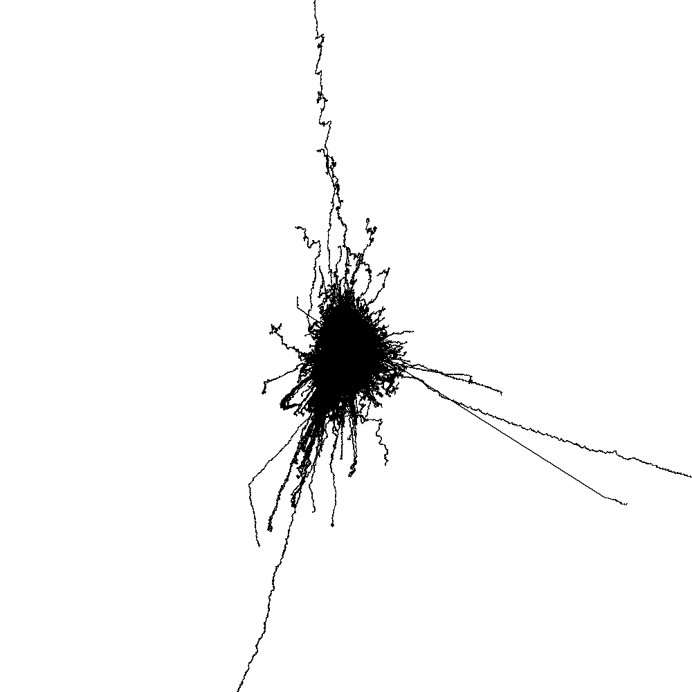
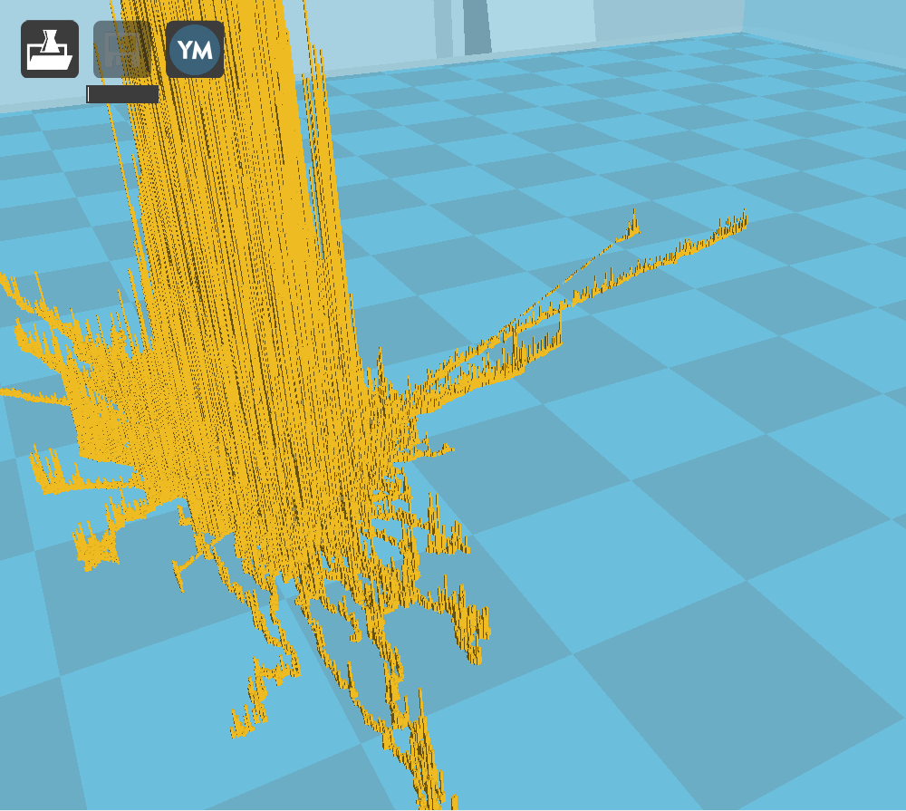
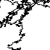
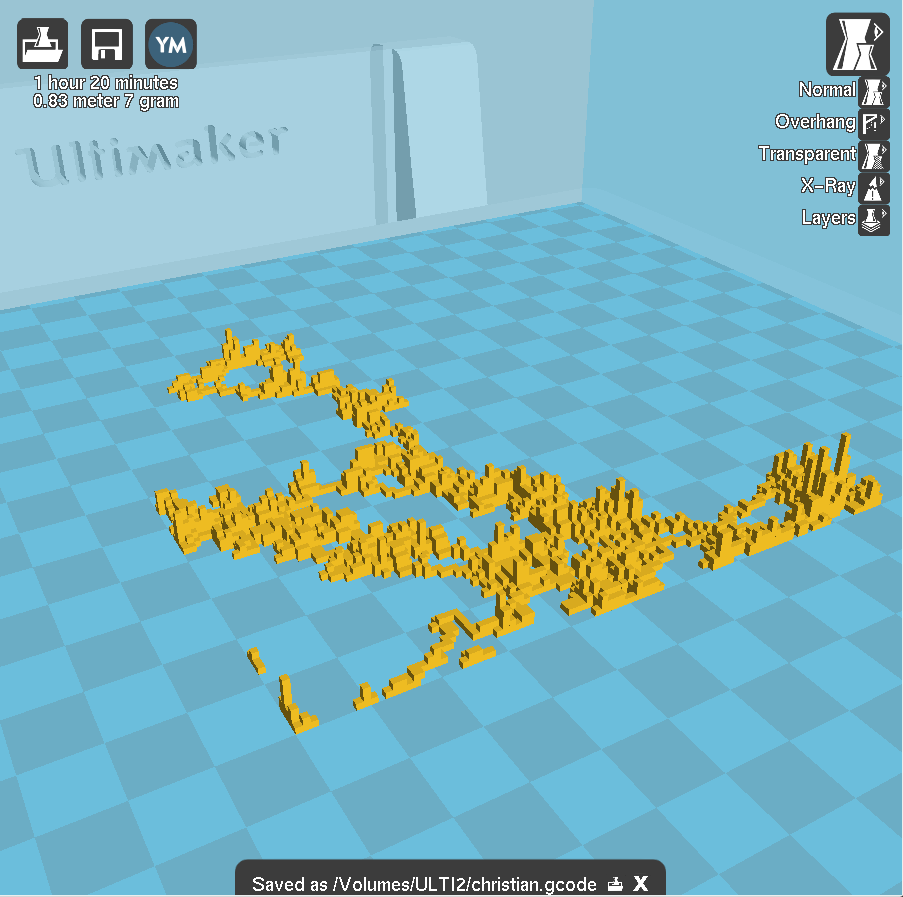
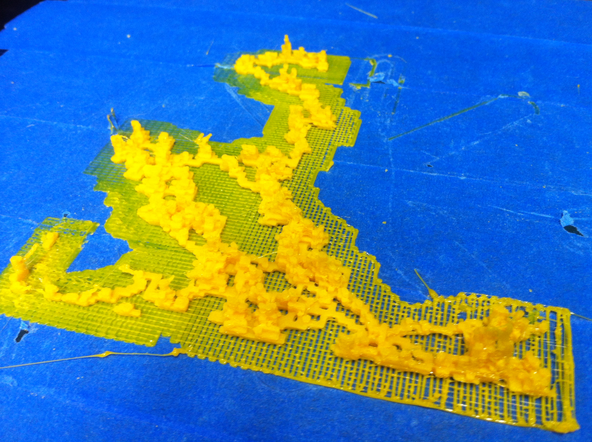
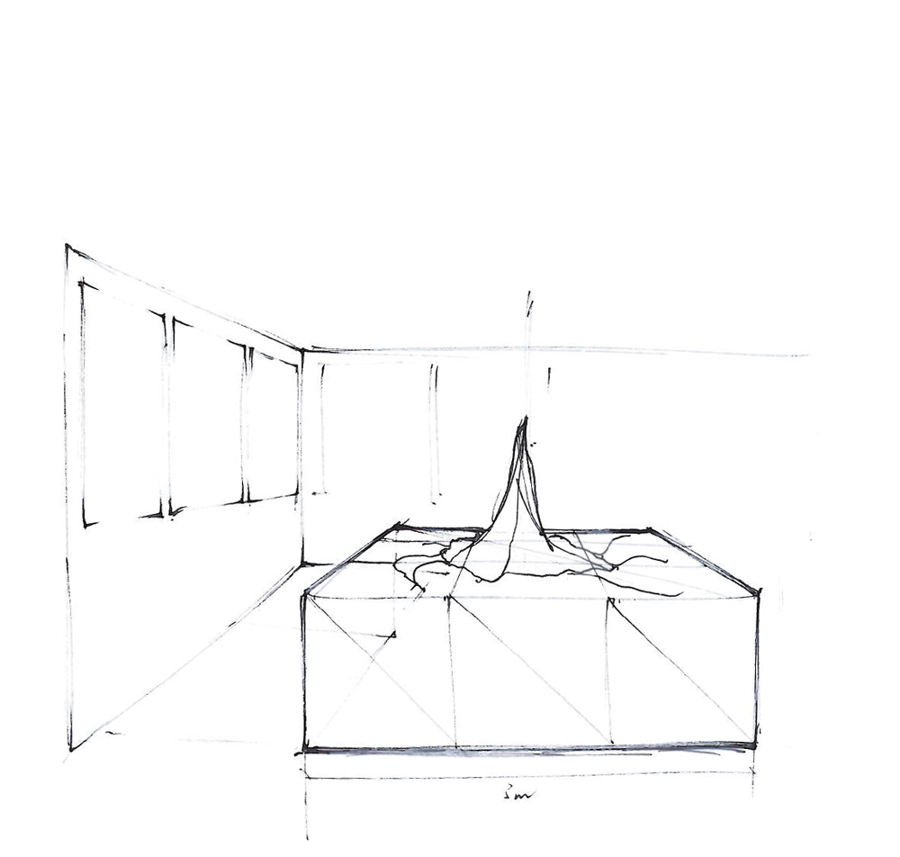
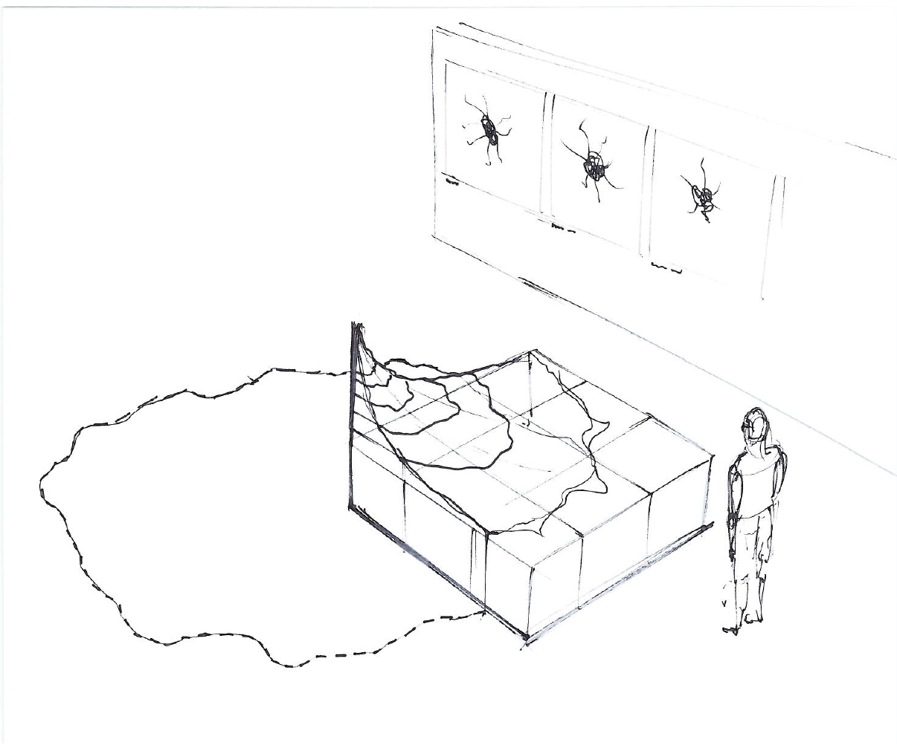
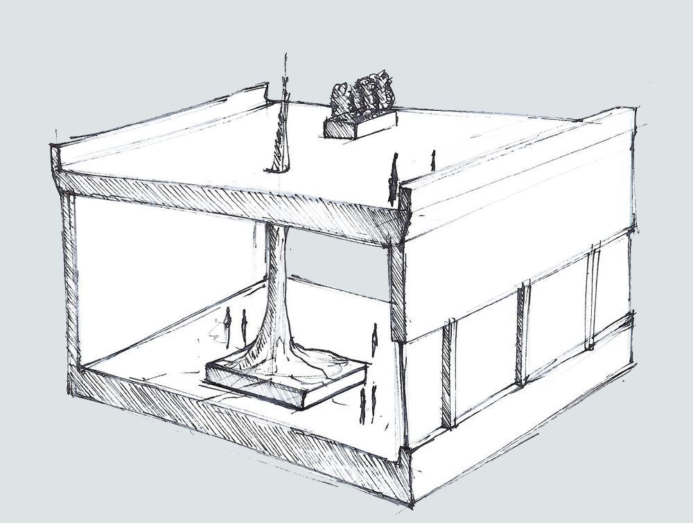

#####Mar 15 2014 3D Printing tcga_i6_2


2D representation of test data


3D view in 3d printing software

**code** 
this is how the 3D model is created:
(processing library in use: http://n-e-r-v-o-u-s.com/tools/obj/)


```
beginRecord("nervoussystem.obj.OBJExport", dateString+"_"+scaleFactor+"_"+"mrna"+".obj"); 
    
  scale(1, 1, 1);
  for (int i = 0; i < context.pixels.length; i++) {
    // data is an array analog to context pixels, it stores amount of draw-overs for every pixel.
    int height = min(int(float(data[i]) * scaleFactor), context.width);
    
    if (height >=  1 && height < (float(context.width) *0.25)) {
      int x = i % context.width;
      int y = (i - x) / context.width;
      pushMatrix();
      translate(x,y, float(height)*0.5);
      box(1,1,-height);
      popMatrix();
    }
  } 
  
endRecord(); 
```

**printing pipeline** the .obj file is converted to printer instructions in [Cura](https://www.ultimaker.com/pages/our-software "cura"). Added a  "raft" to the model (grid structure at the bottom) to make it more robust.





**3d printing** printer: ultimaker original.  The print consists of cubes of 1x1x1 mm. (means 10000px image would be a 3D model of  10x10m in size) 1x1x1mm is the minimum size for recognizable cubes.



**findings** it becomes clear that the 3D model -if its made out of cubic voxels - is way larger in height than it is in width and length. I didn't catch fire for this 3D interpretation, at least not for this first shot. (I think there's even more depth in the colored images than in the single colored 3d print.) Still I should give it a try with less elevation per pixel.

Nevertheless, this lead to some ideas about the exhibition:


a piece of size 3x3m


cut through, show a part only, instead of the whole.


:)


