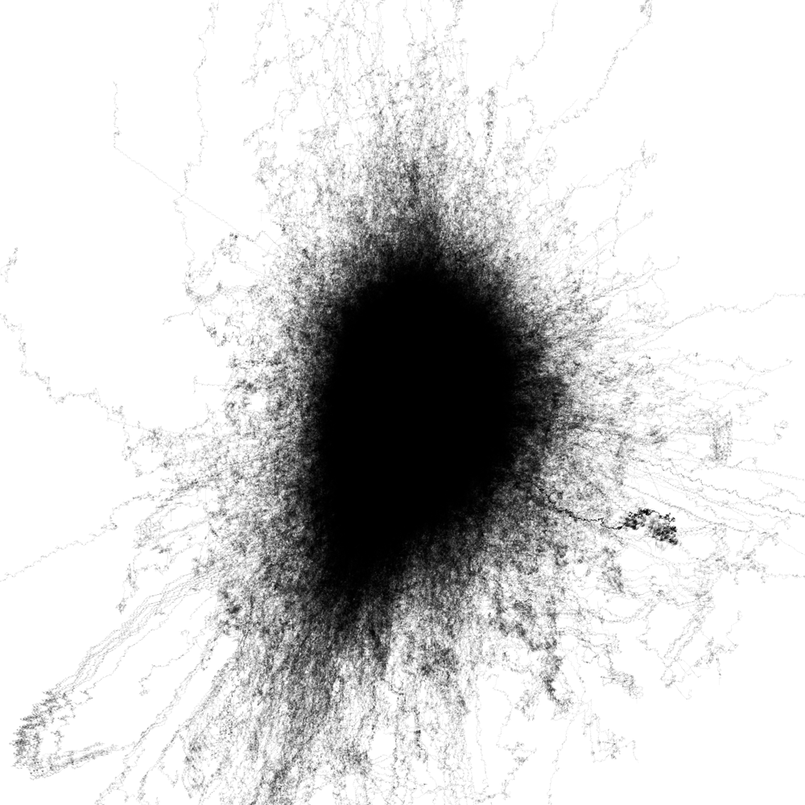

#####Mar 15 2014 First test 3D Printing part of the data

**research** mRNA seems to be an intermediate step during replication, it contains only the coding parts of the dna. the data is divided into thousands of relatively short so called functional groups.
**coding*** by returning to the centre of the image whenever a new function group starts, a new shape developed: 

**finding** much smaller in size, more contrast, has a clear center, offers features that might be characteristic when compared to other animals.

dark area must be many times over painted, if this data is interpreted as 3D the black will be a mountain that peaks in the center of the image, where all functional groups start.

**next step** create a 3D object of the data
