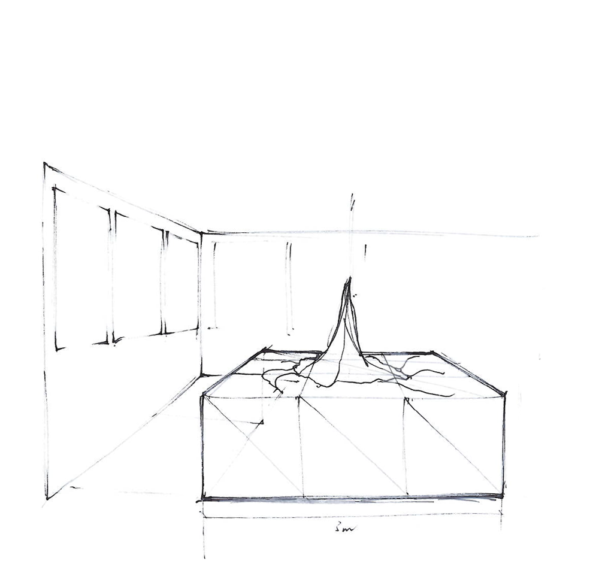

#####Mar 15 14 First test 3D Printing part of the data


**research** mRNA seems to be an intermediate step during replication, it contains only the coding parts of the dna. the data is divided into thousands of relatively short so called functional groups.
**coding*** by returning to the centre of the image whenever a new function group starts, a new shape has developed: 

**finding** much smaller in size, more contrast, has a clear center, offers features that might be characteristic when compared to other animals.
dark area must be thousand times over painted, if this data is interpreted as 3D it must look like this:


**3d printing** printer: ultimaker original.  picture shows a print with a voxelsize of 1x1x1 mm. (means 10000px image would be a 3D model of  10x10m in size) 1x1x1mm looks like the size that looks more or less good.

**code** 
this is how the 3D model is created out of the pixel data:
processing library in use: http://n-e-r-v-o-u-s.com/tools/obj/


```
beginRecord("nervoussystem.obj.OBJExport", dateString+"_"+scaleFactor+"_"+"mrna"+".obj"); 
    
  scale(1, 1, 1);
  for (int i = 0; i < context.pixels.length; i++) {
    // data is an array analog to context pixels, it stores amount of draw-overs for every pixel.
    int height = min(max(0, int(float(data[i]) * scaleFactor)), context.width);
    
    if (height >=  1 && height < (float(context.width) *0.25)) {
      int x = i % context.width;
      int y = (i - x) / context.width;
      pushMatrix();
      translate(x,y,+float(height)*0.5);
      box(1,1,-height);
      popMatrix();
    }
  } 
  
endRecord(); 
```
it becomes clear that the 3D model -if its made out of cubic voxels - is much larger in height than it is in width and height. 

this leads to new thoughts about the presentation:


a piece of size 3x3m


cut through, "pars pro toto"


 

