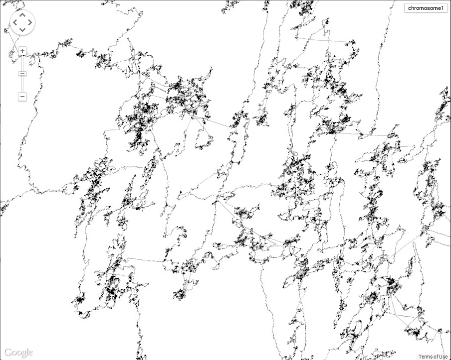

####Review
tcga_i7_map1

So far, I explored three different ways of visualising the genome, DNA in 2D, mRNA in 2D, mRNA in 3D. I decided to concentrate on DNA in 2D.

check out the prototype using google maps.
http://www.to-fuse.ch/dna_map/
the image shown is a part of the chromosome 1 of the genome.

The challenge was not to find my way around the google maps API, the rendering of the different zoomlevels was:

 ** Code ** I thought 2 to 3 seconds time needed to render a single tile is acceptable, nope I was totally wrong! render all tiles for zoom level 6 would take about 20h.. zoomlevel 7 would take 80h and to display the first chromosome as whole I need to go upto  zoomlevel 10 or so. Some optimisation work is needed..
