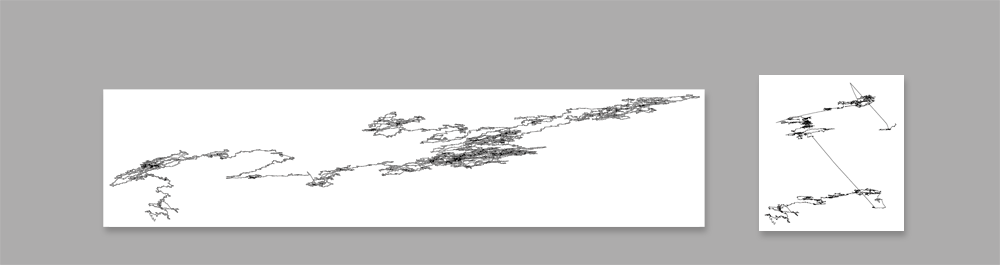

####Installation

The installation consists of 2 images showing the visualisation of the X and Y chromosome of the human dna. Additionally visitors can navigate through the visualisation of the human genome using a large touchscreen. 
The artists aim is to offer access to our dna as the source code of our organisms and encourage discourse about the consequences latest developments in genomics might have to our society and the way we live our lifes.  

##Images of X and Y Chromosomes

The image of the X chromosome is 6.7 by 1.6 meters in size, The image of the Y chromosome is 1.6 by 1.7m in size. They show the chromsome in a resolution of 1200 dpi as one continuos, 1/1200 of an inch black line meandering over the canvas an occaisonally clustering into a concentrating area. The start and end points are marked. The images are placed side by side or on opposing walls, depending on premises. From a distance the images appear as white, empty surfaces, eventually showing a cluster as a greyish stain. Coming close to the image thin black lines of the sequence become visible revealing the vast information stored in the chromosomes.
Along with the images, information is provided to the visitor in an info box: 
*The X and Y chromosomes are the sex-determining chromosomes of the human genome. Females have two identical X chromosomes, while males have an X and a Y chromosome. The information stored in the X chromosome is represented by a sequence of 159 million characters, the Y chromosomes sequence is 59 million letters long. Both sequences consist of 4 different letters only: T, C, G and A. They represent different types of chemical molecules in the helical DNA strands. This visualisation is done by interpreting each of those letters as a drawing directions: T means one step up. C means one step to the right, G means one step down, A means one step to the left.*
(The prints are made on large plotters used in the advertising industry.) 

##Interactive Visualisation

The visualisation allows the visitor to navigate thourgh the whole human genome using the google maps user interface. on the map a number of visually interesting formations are indicated using google maps markers. Users canthe pan and zoom the map.
The installation consists of a high quality, large touch screen mounted in a declined, table-like position and a computer running a browser in fullscreen mode. The map imagery is hosted on a google server. 

The installation might be made accessible to the public through the internet as well. Additionally a user interface could be provided to allow the public to add markers for interesting formations. This would require a moderation of the user generated content.

this is a link to a prototype of the visualisation in google maps:
http://www.to-fuse.ch/dna_map/

pictures of X and Y chromosome side by side:

