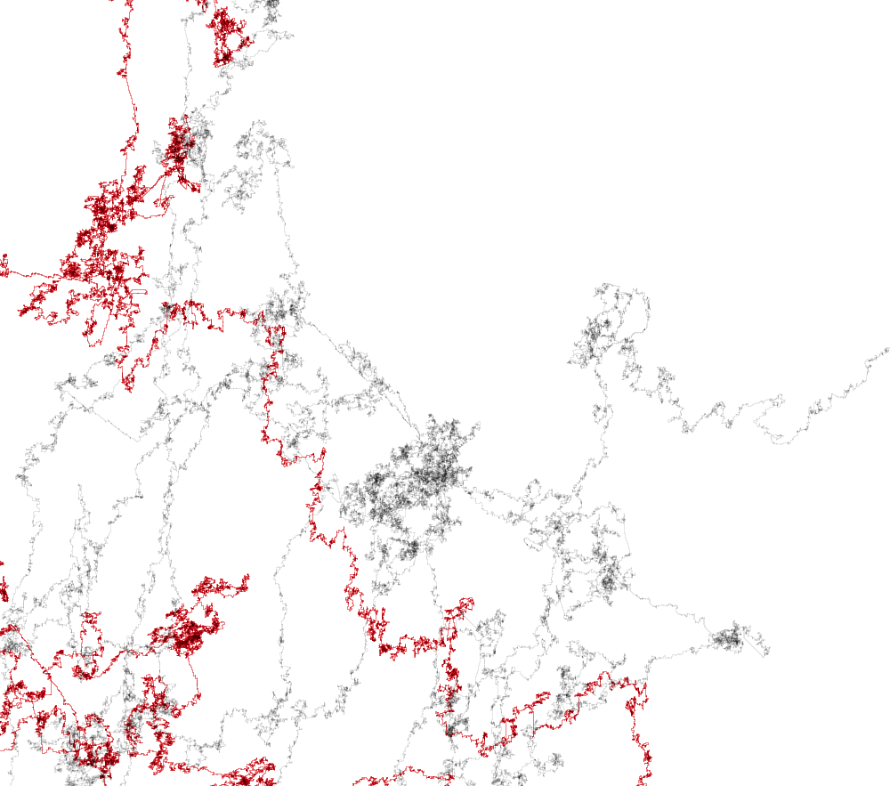

###This is you
by Christian Iten


####Prologue

Back in 2010 I had the following idea:
The information stored in the human dna is represented by a nearly endless sequence of only four different letters: T, C, G and A. What if I interpret those four letters as drawing directions: T means one step up, C one step to the right, and so on. How will it look like? Are there emerging patterns? Could that idea even have scientific relevance?
Back then early experiments showed interesting results, however I lost focus on it somehow. On occasion of the DEVART initiative, I think its time to explore this idea again.
In the begining I was driven by curiousness, I had no specific end result in mind. 

####Privacy & Predestination

Meanwhile, I see this as an "art meets science" project. I'm interested what the consequences of "gene sequencing for the (wealthy) masses" might have for our society on one hand, and on the other, how I would change my life if I knew all my dispositions in detail.
By making this work accessible to the public, my goal is to encourage thinking and discourse. 



####Pseudo Code to draw the dna according to main idea

```
dna = loaddata();
canvas = createCanvas();
for each letter in dna{
	switch (letter) {
		case 't':
	  		currentPos.add(0,-1);
	  		break;
		case 'c':
		  	currentPos.add(1,0);
		  	break;
		case 'g':
		  	currentPos.add(0,1);
		  	break;
		case 'a':
		  	currentPos.add(-1,0);
		  	break;  
		default:
		  	break;
		}
	}
	canvas.lineto(currentPos);
}		    
```
####Tools

http://www.processing.org 
google maps api


