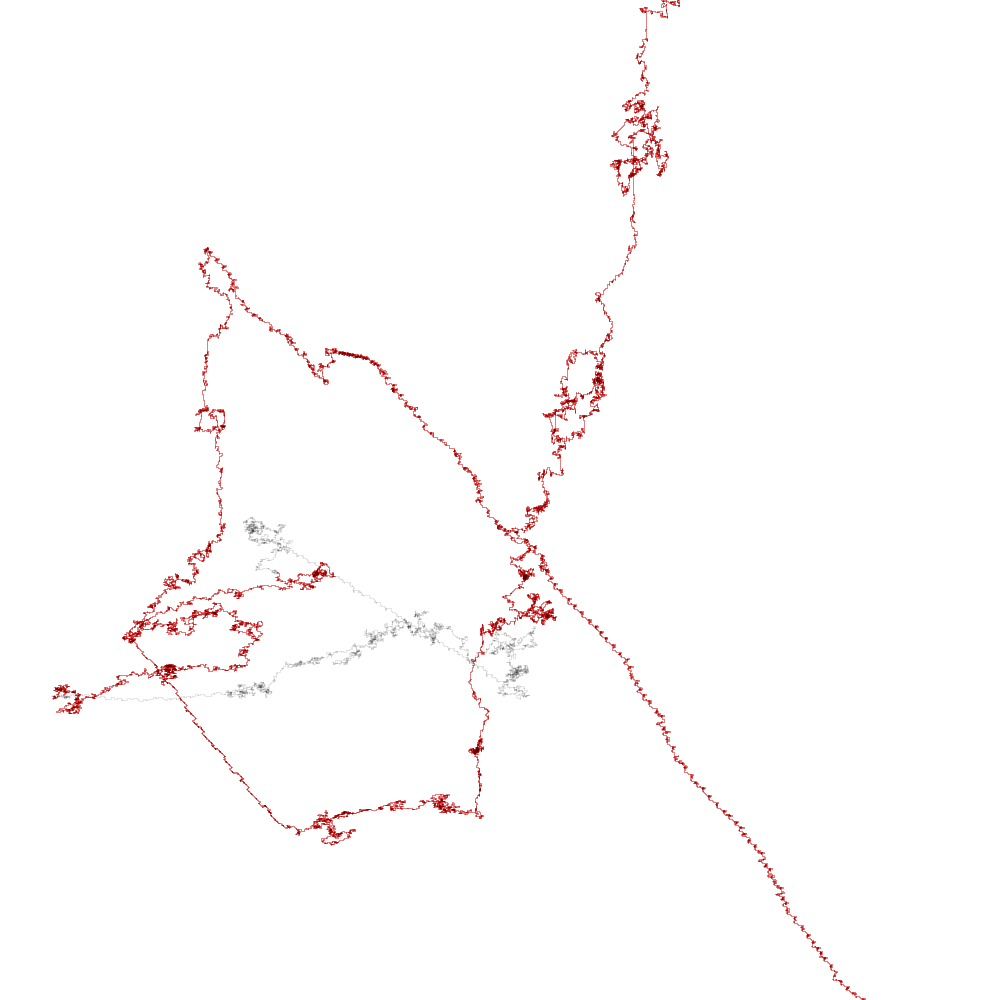

###Is this you?
by Christian Iten


#####Initial Idea

The information stored in the human dna is represented by a nearly endless sequence of four different letters: T, C, G and A. What if I interpret those four letters as drawing directions: T means one step up, C one step to the right, and so on. How will it look like? Are there patterns emerging? Could that visualisation even have scientific relevance?
Back then early experiments showed interesting results, however I lost focus on it somehow. On occasion of the DEVART initiative, I think its time to explore this idea again.
In the begining I was driven by curiousness, I had no specific end result in mind. 

####Motivation

I'm interested what the consequences of "gene sequencing for the masses" might be for our society.
By making this work accessible to the public, my goal is to encourage thinking and discourse about the topic and create an access to non scientists to this data set, stored in each cell of our body on containing the building plan of ourselves. - Is this you? 



Small detail of the human genome. Each pixel represents one letter. Color distinguishes coding from non coding parts. Saturation shows amount of draw-overs. If the whole genome would be visualised as one sequence, 1 pixel per letter, the picture would exceed 1 million pixels in height and 300000 in width. Note the repeating patterns. 

*Read more about the proposed installation in the latest blog entry*


####Pseudo Code 

realisation of main idea

```
dna = loaddata();
canvas = createCanvas();
for each letter in dna{
	switch (letter) {
		case 't':
	  		currentPos.add(0,-1);
	  		break;
		case 'c':
		  	currentPos.add(1,0);
		  	break;
		case 'g':
		  	currentPos.add(0,1);
		  	break;
		case 'a':
		  	currentPos.add(-1,0);
		  	break;  
		default:
		  	break;
		}
	}
	canvas.lineto(currentPos);
}		    
```

####Tools

+ http://www.processing.org 
+ http://n-e-r-v-o-u-s.com/tools/obj/ (.obj exporter)
+ google maps API
+ data source: http://hgdownload.soe.ucsc.edu/downloads.html

